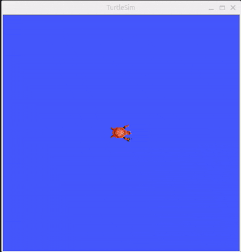

# 🐢 Catch Turtle ROS2 Project

A ROS 2-based simulation project using `turtlesim` where turtles are spawned dynamically and a controller node tracks and catches them automatically.

## 📌 Features

- ✅ Real-time turtle spawning using ROS 2 services
- ✅ Turtle tracking and velocity control via geometry_msgs/Twist
- ✅ Automatic deletion (kill) using service call
- ✅ Full usage of ROS 2 core concepts:
  - Publisher / Subscriber
  - Service / Client
  - Parameters
  - Launch files
  - YAML-based configuration

## 🛠️ Technologies

- ROS 2 (tested on Humble/Jazzy)
- rclcpp (C++ nodes)
- turtlesim
- Custom message and service definitions

## 🚀 How to Run

1. Clone the repository and build:

```bash
cd ~/ros2_ws/src
git clone git@github.com:Dawn-Owl/catch_turtle_ros2.git
cd ..
colcon build
source install/setup.bash
'''

2. Launch the system:
ros2 launch turtlesim_catch_them_all catch_turtles.launch.py
-> this will starte turtlesim_node , turtle_spawner node, turtle_controller node

Turtles will spawn and be caught automatically

------------------------------------------------------------------------

📂 Project Structure

catch_turtle_ros2/
├── src/
│   ├── turtlesim_catch_them_all/     # Main logic (spawner, controller)
│   └── my_robot_interfaces/          # Custom message/service
├── config/
│   └── catch_turtle.yaml             # Parameter config
├── launch/
│   └── catch_turtles.launch.py       # Launch all nodes
├── README.md
├── .gitignore

## 🎥 Demo


